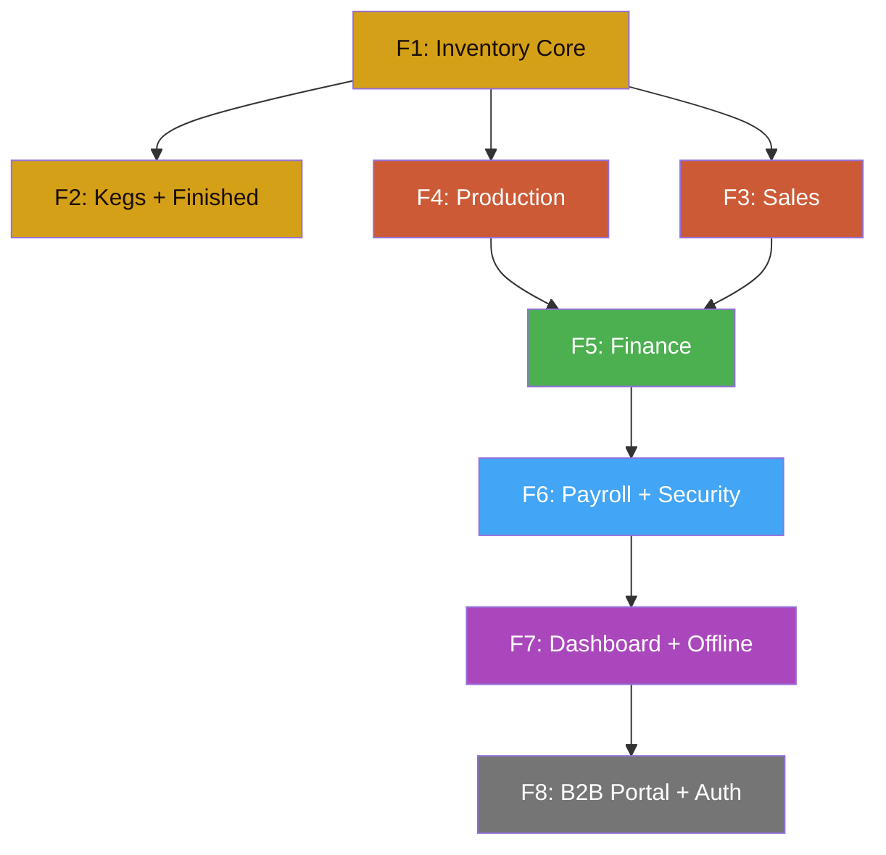

# 🗺️ Frontend Roadmap — Desert Brew OS

## Estado Actual del Scaffold

**29 archivos Dart** · `flutter pub get ✓` · `flutter analyze ✓` · 0 errores

### Plataformas Target

| Plataforma | Soporte | Notas |
|------------|---------|-------|
| 🌐 **Chrome** | ✅ Ready | `flutter run -d chrome` |
| 🖥️ **macOS** | ✅ Ready | `flutter run -d macos` |
| 📱 **iOS** | ⚠️ Requiere Xcode fix | Xcode check crashed en `flutter doctor` |
| 🤖 **Android** | ✅ Ready | Android Studio 2024.3 detectado |

> Para iOS necesitamos reparar Xcode (`flutter doctor` reportó timeout).
> Posiblemente solo falta: `sudo xcodebuild -license accept`

---

## 📊 Estado por Microservicio

| Servicio | Backend Endpoints | Scaffold Pages | Data Layer | BLoC | UI Funcional | Tests |
|----------|:-:|:-:|:-:|:-:|:-:|:-:|
| **Inventory** (8001) | 39 | 3 stubs ✅ | ❌ | ❌ | ❌ | ❌ |
| **Sales** (8002) | 24 | 3 stubs ✅ | ❌ | ❌ | ❌ | ❌ |
| **Security** (8003) | 8 | 1 stub ✅ | ❌ | ❌ | ❌ | ❌ |
| **Production** (8004) | 26 | 3 stubs ✅ | ❌ | ❌ | ❌ | ❌ |
| **Finance** (8005) | 19 | 4 stubs ✅ | ❌ | ❌ | ❌ | ❌ |
| **Payroll** (8006) | 11 | 2 stubs ✅ | ❌ | ❌ | ❌ | ❌ |
| **Total** | **127** | **16 stubs** | — | — | — | — |

**Leyenda:** ✅ Completado · 🔨 En progreso · ❌ Pendiente

Cada módulo necesita 5 capas para estar completo:

```
1. Data Layer     → Models (freezed) + Remote DataSource (Dio) + Local DS (Isar)
2. Domain Layer   → Entities + Repository Interface + UseCases
3. Repository     → Implementación (remote + cache + outbox)
4. BLoC           → Events, States, Bloc + lógica de negocio
5. UI             → Páginas funcionales con widgets, forms, charts
```

---

## 🗓️ Sprint Plan (Frontend)

### Sprint F1: Inventario Core

> **Meta:** Stock dashboard funcional conectado al backend

| Task | Endpoints | Archivos |
|------|:-:|---------|
| `StockBatchModel` (freezed + JSON) | — | `models/stock_batch_model.dart` |
| `InventoryRemoteDataSource` | 8 | `datasources/inventory_remote_ds.dart` |
| `StockRepository` | — | `repositories/stock_repository_impl.dart` |
| `StockBloc` (list, receive, allocate) | — | `bloc/stock_bloc.dart` |
| **Stock Dashboard** funcional | `GET /stock`, `/stock/summary` | `stock_dashboard_page.dart` |
| **Receive Stock** form | `POST /stock` | `receive_stock_page.dart` |
| **Supplier List** | 6 | `supplier_list_page.dart` |
| Tests unitarios (model parsing) | — | `test/unit/models/` |

**Endpoints cubiertos:** 14/39 del Inventory Service

---

### Sprint F2: Kegs + Producto Terminado

> **Meta:** Gestión de barriles FSM + cold room monitor

| Task | Endpoints | Archivos |
|------|:-:|---------|
| `KegAssetModel`, `FinishedProductModel` | — | `models/keg_*.dart`, `models/finished_*.dart` |
| `KegBloc` (list, transition, scan) | 10 | `bloc/keg_bloc.dart` |
| `FinishedProductBloc` | 13 | `bloc/finished_product_bloc.dart` |
| **Keg Management** con FSM visual | `GET/POST kegs/*` | `keg_management_page.dart` |
| **Keg Scanner** (QR/barcode) | `POST /kegs/bulk-scan` | `keg_scan_page.dart` |
| **Finished Products** + cold room | `GET /finished-products/*` | `finished_products_page.dart` |
| **Cold Room Monitor** | `GET /cold-room/status` | `cold_room_monitor_page.dart` |

**Endpoints cubiertos:** 39/39 del Inventory Service ✅

**Dependencia:** `mobile_scanner` package para QR

---

### Sprint F3: Sales Core

> **Meta:** Clientes, catálogo de productos, y notas de venta funcionales

| Task | Endpoints | Archivos |
|------|:-:|---------|
| `ClientModel`, `ProductCatalogModel`, `SalesNoteModel` | — | `models/*.dart` |
| `ClientBloc`, `ProductBloc`, `SalesNoteBloc` | 24 | `bloc/*.dart` |
| **Client List + Detail** (credit, kegs) | 6 | `client_list_page.dart`, `client_detail_page.dart` |
| **Product Catalog** + dual pricing | 8 | `product_catalog_page.dart` |
| **Create Sales Note** (item builder) | 8 | `create_sales_note_page.dart` |
| **Sales Note Detail** + PDF/PNG share | `GET /notes/{id}/pdf` | `sales_note_detail_page.dart` |
| **Margin Report** visual | `GET /products/margin-report` | `margin_report_page.dart` |

**Endpoints cubiertos:** 24/24 del Sales Service ✅

**Dependencia:** `share_plus` para PDF/PNG export

---

### Sprint F4: Producción

> **Meta:** Recetas, batches con state machine, y cost breakdown

| Task | Endpoints | Archivos |
|------|:-:|---------|
| `RecipeModel`, `BatchModel`, `CostModels` | — | `models/*.dart` |
| `RecipeBloc`, `BatchBloc`, `CostBloc` | 26 | `bloc/*.dart` |
| **Recipe List + Detail** (ingredients) | 6 | `recipe_list_page.dart`, `recipe_detail_page.dart` |
| **Create Recipe** (manual form) | `POST /recipes` | `create_recipe_page.dart` |
| **Batch Tracker** con state machine visual | 6 | `batch_tracker_page.dart` |
| **Cost Breakdown** per batch | 2 | `cost_breakdown_page.dart` |
| **Cost Management** (ingredients + fixed) | 12 | `cost_management_page.dart` |

**Endpoints cubiertos:** 26/26 del Production Service ✅

---

### Sprint F5: Finanzas

> **Meta:** Income/Expense tracking, balance, cashflow charts, transfer pricing

| Task | Endpoints | Archivos |
|------|:-:|---------|
| `IncomeModel`, `ExpenseModel`, `BalanceModel` | — | `models/*.dart` |
| `IncomeBloc`, `ExpenseBloc`, `BalanceBloc` | 19 | `bloc/*.dart` |
| **Finance Dashboard** (resumen KPIs) | 2 | `finance_dashboard_page.dart` |
| **Income CRUD + Summary** | 6 | `income_list_page.dart` |
| **Expense CRUD + Summary** | 6 | `expense_list_page.dart` |
| **Balance + Cashflow** (fl_chart) | 2 | `balance_cashflow_page.dart` |
| **Transfer Pricing Rules** | 2 | `transfer_pricing_page.dart` |
| **Internal Transfers** | 2 | `internal_transfers_page.dart` |

**Endpoints cubiertos:** 19/19 del Finance Service ✅

**Dependencia:** `fl_chart` para cashflow visualization

---

### Sprint F6: Payroll + Security

> **Meta:** Nómina, propinas, y enrollment de dispositivos

| Task | Endpoints | Archivos |
|------|:-:|---------|
| `EmployeeModel`, `PayrollModel`, `TipPoolModel` | — | `models/*.dart` |
| **Employee CRUD** | 4 | `employee_list_page.dart` |
| **Payroll Entry** (cálculo con overtime) | 4 | `payroll_entry_page.dart` |
| **Tip Pool** distribution | 3 | `tip_pool_page.dart` |
| **Device Enrollment** (Ed25519) | 6 | `device_enrollment_page.dart` |
| **Device List** + heartbeat | 2 | `device_list_page.dart` |

**Endpoints cubiertos:** 11/11 Payroll + 8/8 Security ✅

**Dependencia:** `cryptography` para Ed25519

---

### Sprint F7: Dashboard + Offline + Polish

> **Meta:** Home dashboard con KPIs reales, offline mode, sync status

| Task | Archivos |
|------|---------|
| **Home Dashboard** con datos reales de todos los servicios | `home_dashboard_page.dart` |
| **Isar integration** — cache offline para read operations | `*_local_ds.dart` |
| **Outbox integration** — queue para writes offline | `outbox_service.dart` |
| **Sync Status** page (pending ops, last sync) | `sync_status_page.dart` |
| **Settings** page (backend host, feature flags) | `settings_page.dart` |
| **Multi-platform testing** — Chrome, macOS, iOS, Android | |

---

### Sprint F8: B2B Client Portal + Auth

> **Meta:** Role-based access para clientes B2B

| Task | Archivos |
|------|---------|
| **Login / Auth** (JWT or device-based) | `login_page.dart` |
| **Role-based routing** (admin vs brewmaster vs b2bClient) | `app_router.dart` |
| **B2B Client View** — only their orders, deliveries, kegs | `b2b_dashboard_page.dart` |
| **Delivery PoD** — firma digital offline | `delivery_pod_page.dart` |

---

## 📐 Diagrama de Dependencias



---

## ⏱️ Estimación de Esfuerzo

| Sprint | Archivos Nuevos | Endpoints | Complejidad | Estimado |
|--------|:-:|:-:|:-:|:-:|
| F1: Inventory Core | ~8 | 14 | Media | 2-3 días |
| F2: Kegs + Finished | ~10 | 25 | Alta (FSM + scanner) | 3-4 días |
| F3: Sales | ~10 | 24 | Alta (forms + PDF) | 3-4 días |
| F4: Production | ~10 | 26 | Alta (state machine) | 3-4 días |
| F5: Finance | ~10 | 19 | Media (charts) | 2-3 días |
| F6: Payroll + Security | ~8 | 19 | Media (crypto) | 2-3 días |
| F7: Dashboard + Offline | ~6 | 0 (aggregation) | Alta (Isar + sync) | 3-4 días |
| F8: B2B Portal + Auth | ~6 | 0 (RBAC) | Alta (auth + roles) | 3-4 días |
| **Total** | **~68** | **127** | | **~22-29 días** |
