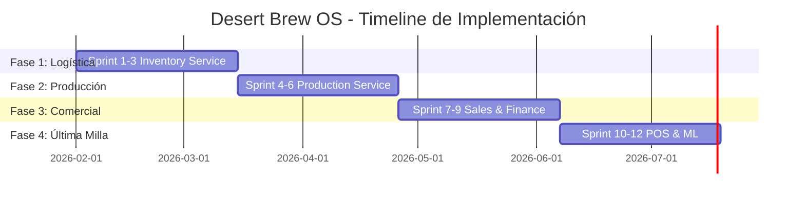

# Desert Brew OS - Roadmap de Implementación

> **Planificación por Sprints: 12 sprints de 2 semanas cada uno (6 meses)**

---

## 📅 Visión General: El Camino Crítico



### Hitos Críticos

| Hito | Sprint | Entregable | Impacto de Negocio |
|------|--------|------------|-------------------|
| **H1** | S3 | Control de Activos | Detenemos la hemorragia de barriles perdidos |
| **H2** | S6 | Cerveza Digital | Certificaciones de calidad + Recall capability |
| **H3** | S9 | Venta Segura | Protección de capital de trabajo |
| **H4** | S12 | Go Live Beta | Operación real Taproom + Planta |

---

## 🔧 Fase 1: Cimientos y Logística (Mes 1-2)

### Sprint 1: Infraestructura & Materia Prima Básica

**Objetivo:** Levantar la base y eliminar la fragilidad de FIFO manual.

#### Entregables Técnicos

- [x] **Setup de Monorepo**
  - Estructura de directorios según Clean Architecture
  - `docker-compose.yml` con Postgres, TimescaleDB, MongoDB, RabbitMQ, Redis
  - Pipeline CI/CD básico (GitHub Actions: lint + test)

- [ ] **Inventory Service: CRUD de Insumos**
  - Modelo `StockBatch` (SKU, lote proveedor, fecha llegada, costo unitario)
  - Endpoint `POST /api/v1/inventory/stock` para registrar recepciones
  - Endpoint `GET /api/v1/inventory/stock/{sku}` con filtros por ubicación

- [ ] **Lógica FIFO**
  - Función `allocate_stock_fifo(sku, cantidad)` con locking (`SELECT ... FOR UPDATE`)
  - Unit tests para race conditions (2 consumos simultáneos del mismo lote)

**Definition of Done:**
- ✅ Test de integración: Crear 3 lotes del SKU `MALTA-PALE-2ROW`, consumir 50kg, verificar que se deducen del lote más antiguo
- ✅ Docker Compose levanta todos los servicios en `< 30 segundos`

---

### Sprint 2: Activos (Kegs) & Máquina de Estados

**Objetivo:** Implementar el rastreador de barriles como activos fijos.

#### Entregables Técnicos

- [ ] **Modelo `KegAsset` completo**
  ```python
  class KegAsset(Base):
      id: str  # UUID
      rfid_tag: str
      size_liters: int
      current_state: KegState  # Enum con FSM
      batch_id: str | None
      cycle_count: int
      last_cleaned_at: datetime | None
  ```

- [ ] **Tabla de Transiciones FSM**
  - Implementar `KegStateMachine` con validaciones estrictas
  - Bloqueo: No llenar barril SUCIO sin pasar por lavado
  - Bloqueo: No despachar barril que no está LLENO

- [ ] **Endpoints Core**
  - `POST /api/v1/kegs` - Registrar nuevo barril
  - `PATCH /api/v1/kegs/{id}/transition` - Cambiar estado con validación
  - `GET /api/v1/kegs?state=EN_CLIENTE` - Reportes filtrados

- [ ] **Modelo `KegMovementLog`**
  - Tabla inmutable de auditoría (from_location, to_location, actor_user_id, timestamp)

**Definition of Done:**
- ✅ Unit test: Intentar transición inválida `EN_CLIENTE → LLENO` debe lanzar `InvalidStateTransitionError`
- ✅ Integration test: Crear barril → Llenarlo → Despacharlo → Retornarlo → Verificar 4 registros en `keg_movements`

---

### Sprint 3: Integración Hardware (Scanner RFID)

**Objetivo:** Operación real de escaneo masivo en muelle.

#### Entregables Técnicos

- [ ] **Endpoint Batch Processing**
  ```python
  POST /api/v1/kegs/bulk-scan
  Body: {
    "keg_ids": ["KEG-001", "KEG-002", ...],
    "action": "RECEIVE_PLANT",
    "location": "Muelle A",
    "actor_id": "user_123"
  }
  ```
  - Procesamiento transaccional (todo o nada)
  - Rollback si 1 barril falla validación

- [ ] **Middleware de Geofencing Lógico**
  - Validar que el `actor_id` tenga permiso en esa `location`
  - Ejemplo: Chofer X solo puede escanear en "Ruta Norte"

- [ ] **Reporte de Activos en Riesgo**
  - `GET /api/v1/kegs/at-risk`
  - Lógica: Barriles en estado `EN_CLIENTE` sin movimiento por > 30 días
  - Formato: CSV descargable para cobranza

**Definition of Done:**
- ✅ Test con scanner físico: Escanear 10 barriles en < 5 segundos
- ✅ Dashboard Flutter: Visualizar barriles "en riesgo" con botón de "Marcar para Recolección"

**📊 Hito 1 Alcanzado:** Control de Activos Operativo

---

## 🏭 Fase 2: El Corazón Productivo (Mes 3-4)

### Sprint 4: Recetas & Batching con Integración BeerSmith

**Objetivo:** Digitalizar el proceso de cocción con integración de recetas desde BeerSmith.

#### Entregables Técnicos

- [ ] **Modelo de Receta (BOM - Bill of Materials)**
  ```python
  class Recipe(Base):
      id: str
      name: str  # "IPA Desert Sunset"
      version: int
      beer_style: str
      
      # Volúmenes (de BeerSmith)
      preboil_volume_liters: Decimal
      postboil_volume_liters: Decimal
      target_volume_liters: Decimal
      
      # Eficiencia
      brewhouse_efficiency: Decimal  # 72%
      
      # Gravities
      target_og: Decimal
      target_fg: Decimal
      target_abv: Decimal  # Calculado automáticamente
      
      # IBUs y Color
      ibu: Decimal | None
      srm: Decimal | None
      
      ingredients: List[RecipeIngredient]
  ```

- [ ] **Formulario Optimizado para Ingreso Manual**
  - UI Flutter/Web que replica estructura de BeerSmith
  - Secciones colapsables:
    - Información General (nombre, estilo, versión)
    - Volúmenes (pre-boil, post-boil, target)
    - Gravities (OG, FG con cálculo automático de ABV)
    - Ingredientes (tabla dinámica con +/- rows)
  - Validación en tiempo real de SKUs vs. Inventory

- [ ] **Modelo `ProductionBatch`**
  - Relación con Recipe
  - Estado: `BREWING`, `FERMENTING`, `CONDITIONING`, `PACKAGED`, `ARCHIVED`
  - Fecha de inicio/fin por fase
  - Volúmenes reales vs. target (para cálculo de mermas)

- [ ] **Consumo de Inventario (Event-Driven)**
  - Al crear Batch, publicar evento `batch.created` en RabbitMQ
  - Inventory Service consume y ejecuta `allocate_stock_fifo` para cada ingrediente
  - Responde con `batch.ingredients_allocated` o `batch.insufficient_stock`

- [ ] **Endpoint de Registro Post-Cocción**
  ```python
  PATCH /api/v1/batches/{id}/brewing-complete
  {
    "actual_preboil_volume": 24.5,
    "actual_postboil_volume": 21.8,
    "volume_to_fermenter": 20.0,
    "measured_og": 1.058
  }
  ```
  - Cálculo automático de mermas (boil + transfer)
  - Alerta si mermas > 15%

**Definition of Done:**
- ✅ Test end-to-end: Ingresar receta manualmente desde datos BeerSmith → Crear lote → Verificar deducción FIFO de malta y lúpulo
- ✅ Rollback: Si falta 1 ingrediente, NO se crea el lote y NO se deduce nada
- ✅ UI: Formulario responsive con autocomplete de SKUs
- ✅ Test: Ingresar volúmenes reales post-cocción → Sistema calcula mermas y las registra

**Nota:** El importador BeerXML automático se implementará en Sprint 6+ (opcional).

---

### Sprint 5: Trazabilidad Genealógica

**Objetivo:** Implementar rastreo bidireccional completo.

#### Entregables Técnicos

- [ ] **Tabla de Linkeo: `batch_ingredient_usage`**
  ```sql
  CREATE TABLE batch_ingredient_usage (
      batch_id TEXT,
      stock_batch_id INT,  -- Lote específico de malta usado
      quantity_used FLOAT,
      cost_at_time DECIMAL
  );
  ```

- [ ] **Linkeo Batch → Kegs**
  - Al empacar, asignar `batch_id` a cada barril llenado
  - Endpoint: `POST /api/v1/batches/{id}/package`
  - Body: `{"keg_ids": ["KEG-050", "KEG-051", ...], "volume_packaged": 850}`

- [ ] **Endpoints de Trazabilidad**
  - `GET /api/v1/batches/{id}/ingredients` - Upstream trace
  - `GET /api/v1/batches/{id}/kegs` - Downstream trace
  - `GET /api/v1/kegs/{id}/batch` - De barril a lote

**Definition of Done:**
- ✅ Smoke test: Dado `KEG-050`, obtener el proveedor de la malta usada en ese barril
- ✅ Reporte de Recall: Si Proveedor X reporta contaminación en Lote Y de malta, listar todos los clientes afectados

---

### Sprint 6: Telemetría IoT Base

**Objetivo:** Capturar datos de fermentación en tiempo real.

#### Entregables Técnicos

- [ ] **Setup de TimescaleDB**
  - Crear hypertable `fermentation_readings` (chunk interval 7 días)
  - Índice compuesto: `(batch_id, time DESC)`
  - Política de compresión para datos > 30 días

- [ ] **Pipeline MQTT → TimescaleDB**
  ```
  Sensor ESP32 → Mosquitto (MQTT) → Telegraf → RabbitMQ (queue: production.telemetry) → Python Worker → TimescaleDB
  ```

- [ ] **Modelo `FermentationReading`**
  - Campos: `time`, `batch_id`, `tank_id`, `temperature`, `gravity`, `ph`, `pressure`

- [ ] **Validación de Rangos Físicos**
  ```python
  @validator('temperature')
  def temp_must_be_realistic(cls, v):
      if not 0 <= v <= 40:  # °C
          raise ValueError('Fermentación no puede estar a esta temperatura')
      return v
  ```

- [ ] **Endpoint de Ingesta Manual**
  - `POST /api/v1/telemetry` para ingresar datos del brewmaster (pre-IoT)

**Definition of Done:**
- ✅ Publicar 1000 lecturas MQTT → Verificar ingesta en TimescaleDB en < 2 segundos
- ✅ Dashboard Flutter: Gráfica de temperatura en tiempo real con actualización cada 30s

**📊 Hito 2 Alcanzado:** Cerveza Digital con Trazabilidad Completa

---

## 💰 Fase 3: Flujo de Caja (Mes 5)

### Sprint 7: Clientes & Pedidos B2B

**Objetivo:** Estructura base de ventas con MongoDB.

#### Entregables Técnicos

- [ ] **Setup MongoDB Collections**
  - `clients`: Datos fiscales, límites de crédito, metadata de zona
  - `orders`: Documentos con arrays de items, descuentos dinámicos

- [ ] **Modelo de Cliente**
  ```python
  class Client(BaseModel):
      id: str
      business_name: str
      rfc: str
      credit_limit: Decimal
      max_allowed_kegs: int
      delivery_zone: str
  ```

- [ ] **CRUD de Pedidos**
  - Estados: `DRAFT`, `CONFIRMED`, `INVOICED`, `DELIVERED`, `CANCELLED`
  - Endpoint: `POST /api/v1/orders` con validación de items
  - Endpoint: `PATCH /api/v1/orders/{id}/status`

**Definition of Done:**
- ✅ Crear cliente "Restaurante El Túnel" con límite de crédito $20,000 MXN
- ✅ Crear pedido borrador, confirmar, verificar transición de estados

---

### Sprint 8: Motor de Bloqueo (Credit Logic)

**Objetivo:** Implementar la regla de oro: Double-Gate Credit Control.

#### Entregables Técnicos

- [ ] **Middleware `validate_order_approval`**
  - Check 1: Llamada async a Finance Service → `GET /api/v1/clients/{id}/balance`
  - Check 2: Llamada async a Inventory Service → `GET /api/v1/kegs/count?client_id={id}`
  - Lógica AND: Ambos checks deben pasar

- [ ] **Custom Exception**
  ```python
  class CreditBlockedException(HTTPException):
      def __init__(self, errors: List[str]):
          super().__init__(
              status_code=403,
              detail={"blocking_reasons": errors}
          )
  ```

- [ ] **Logging de Bloqueos**
  - Tabla `credit_blocks` para auditoría
  - Campos: `order_id`, `client_id`, `block_reason`, `timestamp`

**Definition of Done:**
- ✅ Test: Cliente con deuda $18,000 intenta pedir $5,000 → Sistema bloquea (límite $20,000)
- ✅ Test: Cliente con 12 barriles intenta pedir 5 más → Sistema bloquea (max 10)
- ✅ Flutter: Mostrar dialog rojo con razones específicas de bloqueo

---

### Sprint 9: Costos & Impuestos (IEPS)

**Objetivo:** Automatizar el cálculo financiero post-producción.

#### Entregables Técnicos

- [ ] **Algoritmo de Costo Promedio Ponderado**
  ```python
  def calculate_batch_cost(batch_id: str) -> Decimal:
      ingredients = get_ingredient_usage(batch_id)
      labor = get_labor_hours(batch_id) * LABOR_RATE
      energy = get_tank_hours(batch_id) * ENERGY_RATE
      
      total_cost = sum(i.cost for i in ingredients) + labor + energy
      volume_packaged = get_packaged_volume(batch_id)
      
      return total_cost / volume_packaged
  ```

- [ ] **Motor de IEPS/IVA**
  ```python
  def calculate_invoice_totals(subtotal: Decimal) -> TaxResult:
      ieps = subtotal * Decimal('0.265')
      iva_base = subtotal + ieps
      iva = iva_base * Decimal('0.16')
      return TaxResult(ieps=ieps, iva=iva, total=iva_base + iva)
  ```

- [ ] **Trigger Post-Packaging**
  - Evento: `batch.packaged` → Finance Service calcula costo y lo almacena
  - Tabla: `batch_costs` (batch_id, cost_per_liter, calculation_date)

**Definition of Done:**
- ✅ Test: Lote con $10,000 en insumos, 850L empacados → Costo = $11.76/L
- ✅ Test: Factura de $1,000 → IEPS $265, IVA $202.40, Total $1,467.40
- ✅ Reporte Excel: Comparativa de costos por lote (mes actual vs. histórico)

**📊 Hito 3 Alcanzado:** Venta Segura - Capital Protegido

---

## 📱 Fase 4: La Última Milla (Mes 6)

### Sprint 10: POS Taproom - Catálogo y Gestión de Restaurante

**Objetivo:** Sistema completo de punto de venta para operación de Taproom con alimentos, bebidas y gestión de staff.

#### Entregables Técnicos

- [ ] **Setup Clean Architecture**
  ```
  lib/
  ├── features/
  │   ├── pos/
  │   │   ├── presentation/  (BLoC + Views)
  │   │   ├── domain/        (Entities + Repositories)
  │   │   └── data/          (Drift DB + HTTP clients)
  │   ├── kitchen/           (KDS - Kitchen Display System)
  │   └── staff/             (Nómina, control de turnos)
  └── core/
      └── sync/              (Outbox pattern)
  ```

- [ ] **Catálogo Multi-Producto**
  ```dart
  abstract class MenuItem {
    String id;
    String name;
    Decimal price;
    String category;  // "CERVEZA", "ALIMENTO", "BEBIDA_NA"
    bool available;
  }
  
  class BeerMenuItem extends MenuItem {
    String batchId;        // Trazabilidad
    int volumeMl;          // 355, 473, 940
    bool isGuestBeer;      // Cerveza invitada
  }
  
  class FoodMenuItem extends MenuItem {
    List<Modifier> modifiers;  // Sin cebolla, extra queso
    int prepTimeMinutes;
    bool requiresKitchen;
  ```

- [ ] **Sistema de Modificadores**
  - Tabla `modifiers` en Drift
  - UI de selección múltiple
  - Precio adicional por modificador

- [ ] **Gestión de Turnos y Propinas**
  ```dart
  class Shift extends Table {
    IntColumn get id => integer().autoIncrement()();
    TextColumn get staffId => text()();
    DateTimeColumn get clockIn => dateTime()();
    DateTimeColumn get clockOut => dateTime().nullable()();
    RealColumn get tipsEarned => real().withDefault(const Constant(0))();
    IntColumn get tablesServed => integer().withDefault(const Constant(0))();
  }
  
  class TipDistribution extends Table {
    // Configuración de pooling
    TextColumn get role => text()();  // MESERO, BARTENDER
    RealColumn get poolPercentage => real()();  // 100%, 30%
  }
  ```

- [ ] **UI de Propinas**
  - Botones de sugerencia: 10% / 15% / 20% / Custom
  - Cálculo automático sobre subtotal
  - Visualización de propinas acumuladas en turno

- [ ] **Integración KDS (Kitchen Display System)**
  - App secundaria para cocina (tablet)
  - Ordenes en tiempo real con prioridad (FIFO + urgencia)
  - Notificaciones push cuando platillo está listo

**Definition of Done:**
- ✅ Build APK/iOS para mesero y cocina
- ✅ Test: Crear orden mixta (2 cervezas + 1 hamburguesa + modificador) → Verificar split kitchen/bar
- ✅ Test: Simular turno de 4 horas → 10 cuentas → Verificar distribución de propinas
- ✅ UI: Diseño Material 3 optimizado para uso con una mano (meseros caminando)

---

### Sprint 11: Sincronización Offline y Nómina

**Objetivo:** Operación sin internet por horas y cierre automático de nómina.

#### Entregables Técnicos

- [ ] **Tabla `PendingActions`**
  ```dart
  class PendingActions extends Table {
    IntColumn get id => integer().autoIncrement()();
    TextColumn get actionType => text()();
    TextColumn get payloadJson => text()();
    DateTimeColumn get createdAt => dateTime()();
    IntColumn get syncStatus => integer()();  // 0=Pending, 1=Synced, 2=Error
    IntColumn get attempts => integer()();
  }
  ```

- [ ] **SyncManager (Isolate)**
  - Polling cada 10 segundos si hay conectividad
  - Procesar acciones pendientes en orden FIFO
  - Exponential backoff en caso de 5xx errors

- [ ] **Manejo de Conflictos**
  - Si el servidor retorna `409 Conflict`, marcar acción como `NEEDS_RESOLUTION`
  - Mostrar badge en UI para que el usuario resuelva manualmente

- [ ] **Cierre Automático de Nómina**
  - Al hacer `clock_out`, calcular:
    - Horas trabajadas
    - Propinas acumuladas por shift
    - Distribución según `tip_pool_percentage`
  - Endpoint: `POST /api/v1/staff/close-shift`
  
- [ ] **Reportes de Nómina**
  ```python
  # Backend
  GET /api/v1/reports/payroll?period=2026-02-01:2026-02-15
  
  Response:
  {
    "staff": [
      {
        "name": "Juan Pérez",
        "role": "MESERO",
        "total_hours": 80,
        "base_salary": 8000.00,
        "tips_earned": 3500.00,
        "total": 11500.00
      }
    ]
  }
  ```

**Definition of Done:**
- ✅ Test: Crear 3 acciones offline → Reconectar → Verificar sincronización en < 30 segundos
- ✅ Test: Simular error 500 del servidor → Verificar 3 reintentos con delay creciente
- ✅ Test: Mesero trabaja 8 horas, gana $450 en propinas → Verificar cálculo correcto en reporte quincenal

---

### Sprint 12: POS Taproom & ML Predictivo

**Objetivo:** Go Live operativo y primera predicción ML.

#### Entregables Técnicos

- [ ] **Interfaz de Comanda (Taproom)**
  - Grid de productos con fotos
  - Carrito de compra con subtotales
  - Botón "Cerrar Cuenta" con cálculo de propina opcional

- [ ] **Impresión Térmica**
  - Integración con librería `esc_pos_printer`
  - Comandos ESC/POS para formato de ticket
  - Fallback a PDF si falla la impresora

- [ ] **ML Service: Predicción de FG**
  - Modelo Ridge Regression entrenado con lotes históricos
  - Endpoint: `POST /api/v1/ml/predict-fg`
  - Input: Lecturas de primeras 48h → Output: FG estimado ± error

- [ ] **Dashboard de Sostenibilidad**
  - Gráficas de kWh/L y agua/L
  - Comparativa con promedio de industria (benchmark hardcoded inicial)

**Definition of Done:**
- ✅ Venta real en Taproom: Cliente pide 2 IPAs → Ticket impreso → Pago registrado
- ✅ Test offline: Operar POS 2 horas sin internet → Reconectar → Todas las ventas sincronizadas
- ✅ ML: Predicción de FG con error < 0.005 en 80% de casos de test

**📊 Hito 4 Alcanzado:** Go Live Beta - Sistema en Operación Real

---

## ⚠️ Riesgos Técnicos y Mitigaciones

| Riesgo | Probabilidad | Impacto | Mitigación |
|--------|-------------|---------|------------|
| Latencia de red en almacén | Alta | Medio | Batch processing + Queue local en scanner |
| Race conditions en stock | Media | Alto | `SELECT ... FOR UPDATE` + Optimistic Locking en MongoDB |
| Datos basura de sensores | Alta | Bajo | Validators Pydantic con rangos físicos |
| Pérdida de barriles por robo | Media | Crítico | Alertas automáticas + Geofencing |
| Fallo de sincronización POS | Baja | Alto | Outbox pattern + Exponential backoff |

---

## 📊 Métricas de Éxito

### KPIs Operativos (Post Go-Live)

- **Tasa de Pérdida de Barriles:** < 2% anual
- **Precisión de Inventario:** > 98% (conteo físico vs. sistema)
- **Uptime del POS:** > 99.5% (incluyendo modo offline)
- **Tiempo de Sincronización:** < 30 segundos post-reconexión

### KPIs de Industria 5.0

- **Adopción de Sugerencias ML:** > 70% de las alertas son aceptadas por brewmaster
- **Reducción de Mermas:** 15% → 12% en 6 meses
- **Eficiencia Energética:** -10% kWh/L en 1 año

---

## 🎯 Próximos Pasos Post-Sprint 12

1. **Integración SCADA:** Control automático de válvulas de glicol
2. **BI Avanzado:** Apache Superset para dashboards ejecutivos
3. **Mobile App para Choferes:** Rutas optimizadas con TSP solver
4. **Blockchain para Trazabilidad:** NFT de cada lote para clientes premium

---

**Actualizado:** 2026-02-01  
**Owner:** Equipo de Ingeniería Desert Brew Co.
