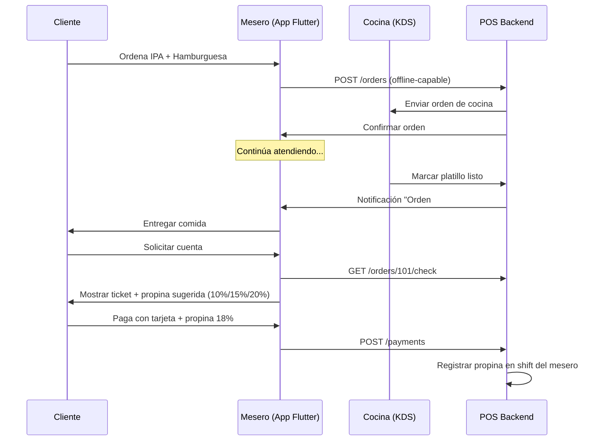

# Desert Brew OS

> **Sistema de Ejecución de Manufactura (MES) y ERP Modular para Cervecería Artesanal de Alta Eficiencia**

---

## 🏭 Contexto Operativo

### La Realidad Industrial de Saltillo

Desert Brew Co. opera en **Saltillo, Coahuila**, el "Detroit de México", rodeados de proveedores Tier-1 automotrices y plantas de ensamblaje globales. El estándar de ingeniería en esta región no perdona la fragilidad.

**Desert Brew OS** no es un proyecto experimental; es un **Sistema de Ejecución de Manufactura (MES)** envuelto en un ERP, diseñado para sobrevivir a la dura realidad del piso de producción:

- 🌡️ Alta humedad en zonas de cocción
- ⚗️ Corrosión química (sosa cáustica, ácido peracético)
- ⚡ Inestabilidad en la red eléctrica
- 🔥 Calor implacable del Desierto de Coahuila 

Este sistema está diseñado para **escalar de 2,000 a 50,000 hectolitros anuales** bajo un régimen de eficiencia operativa estricta.

---

## 🎯 Objetivo de Negocio

Eliminar hojas de cálculo frágiles y monolitos heredados mediante un sistema distribuido que garantice:

1. **Trazabilidad Total** (Farm-to-Glass): Desde el proveedor de malta hasta el consumidor final
2. **Control de Activos**: Cero pérdida de barriles (CAPEX crítico)
3. **Operación Offline**: El Taproom y Rutas de entrega funcionan sin internet
4. **Cumplimiento Fiscal**: Cálculo automático de IEPS/IVA según legislación mexicana
5. **Industria 5.0**: Colaboración humano-máquina con IA predictiva

---

## 🏗️ Arquitectura de Microservicios

### Patrón: Database-per-Service en Monorepo

```
Desert Brew OS/
├── services/
│   ├── inventory_service/      → PostgreSQL (Puerto 8001)
│   ├── production_service/     → TimescaleDB (Puerto 8002)
│   ├── sales_service/          → MongoDB (Puerto 8003)
│   ├── pos_service/            → SQLite local (Puerto 8004)
│   ├── finance_service/        → PostgreSQL (Puerto 8005)
│   ├── ml_service/             → Redis + scikit-learn (Puerto 8006)
│   └── analytics_service/      → Postgres + Superset (Puerto 8007)
├── frontend_pos/               → Flutter (Clean Architecture)
├── infra/
│   ├── docker-compose.yml
│   ├── nginx/
│   └── rabbitmq/
└── iot/
    └── mqtt_bridge/
```

### Bounded Contexts (DDD)

| Servicio | Contexto | Responsabilidad Principal | Status |
|----------|----------|---------------------------|--------|
| **Inventory** | Activos & Logística | FSM de Barriles, FIFO de Materia Prima, Corrección Física de Volumen | ✅ v0.4.0 |
| **Production** | Proceso | Recetas BeerSmith, Lotes con State Machine, Cost Allocation FIFO, Telemetría IoT | ✅ v0.1.0 |
| **Sales B2B** | Transacción Mayorista | Credit Control, Catálogo Digital (estilo BEES), Rutas, Pedidos Multi-SKU | 🔄 v0.1.0 (core) |
| **POS Taproom** | Venta Directa | Catálogo de Alimentos/Bebidas, Cervezas Invitadas, Propinas, Nómina de Meseros | 📋 Planned |
| **Finance** | Valuación | Transfer Pricing, P&L Segregation, IEPS/IVA, Balance General, Estado de Resultados | ✅ v0.1.0 |
| **Security** | Autenticación | Device Enrollment Ed25519, Signature Verification, Offline PoD | ✅ v0.1.0 |
| **ML** | Inteligencia | Predicción Fermentación, Forecast de Ventas, Optimización de Insumos | 📋 Planned |
| **Admin** | Administración | RH (Nóminas Producción), Proveedores, Clientes, Costos Operativos | 📋 Planned | 
---

## 🔑 Reglas de Negocio Críticas

### 1. Logística Inversa: Activos vs. Saldos

**Barriles (20L, 30L, 60L):**
- Son **Activos Serializados** (ID único con QR/RFID)
- Trazabilidad individual mediante FSM (7 estados)
- Tratados como *dunnage* retornable automotriz

**Botellas/Caguamas:**
- Son **Saldos** (Cuentas Corrientes)
- No se rastrea la unidad individual
- Ejemplo: Cliente debe 10 cajas → Devuelve 5 → Saldo = 5 cajas

### 2. Double-Gate Credit Control

Antes de autorizar una venta B2B, el sistema valida **atómicamente**:

```
IF (Deuda_Financiera + Pedido_Actual) > Límite_Crédito THEN BLOCK
IF (Barriles_En_Cliente + Barriles_Pedido) > Max_Barriles THEN BLOCK
```

### 3. Trazabilidad Bidireccional

- **Upstream:** ¿Qué lote de malta entró en el Lote #104?
- **Downstream:** ¿Qué clientes recibieron barriles del Lote #104?

### 4. Costo Promedio Ponderado (WAC)

El costo NO es fijo; se calcula **post-producción**:

```
Costo_Litro = (Σ Insumos + MO + Energía) / Volumen_Envasado_Real
```

Si cocinamos 1000L pero solo envasamos 850L (15% merma), el costo se distribuye sobre **850L vendibles**.

---

## 🍺 POS Taproom: Operación Completa de Restaurante

### Alcance Funcional

El **POS del Taproom** no es solo un sistema de ventas; es una plataforma completa de gestión de restaurante cervecero:

#### Catálogo de Productos

1. **Cervezas Propias**
   - Por barril (20L/30L/60L) o botella
   - Precio por ml con ajuste dinámico (happy hour)
   - Control de inventario en tiempo real

2. **Cervezas Invitadas (Guest Beers)**
   - Validación de proveedor externo
   - Margen configurable por estilo
   - Rotación destacada en menú

3. **Alimentos**
   - Categorías: Entradas, Platos Fuertes, Postres
   - Modificadores (sin cebolla, extra queso)
   - Integración con cocina (KDS - Kitchen Display System)

4. **Bebidas Sin Alcohol**
   - Refrescos, aguas, cocteles sin alcohol
   - Gestión de inventario separada

#### Gestión de Nómina y Propinas

```python
# Modelo de Nómina Integrado
class StaffMember(Base):
    id: str
    name: str
    role: str  # "MESERO", "BARTENDER", "HOSTESS", "COCINERO"
    hourly_rate: Decimal
    tip_pool_percentage: Decimal  # 100% para meseros, 30% para bartenders
    
class Shift(Base):
    id: str
    staff_id: str
    clock_in: datetime
    clock_out: datetime | None
    tips_earned: Decimal  # Acumulado durante turno
    tables_served: int
```

**Distribución de Propinas:**
- Sistema de **pooling** configurable
- Cálculo automático al cierre de caja
- Integración con nómina semanal / ajustado a salario diario 
- Bonificación por servicio de taxi

#### Flujo de Trabajo Taproom



---

## 🏪 Sales B2B: Estructura BEES/HeiShop

### Inspiración: Plataformas de Distribución Cervecera

**BEES (AB InBev)** y **HeiShop (Heineken)** revolucionaron la distribución B2B con:

1. **Catálogo Digital Inteligente**
   - Precios dinámicos por cliente (volumen, fidelidad)
   - Promociones automáticas (2x1, descuento por volumen)
   - Sugerencias basadas en historial de compra

2. **Gestión de Crédito Integrada**
   - Visualización en tiempo real de línea de crédito
   - Bloqueo automático pre-venta
   - Facilidades de pago (parcialidades)

3. **Optimización de Rutas**
   - Algoritmo de TSP (Traveling Salesman Problem)
   - Ventanas de entrega negociadas
   - Tracking en vivo del chofer

### Implementación Desert Brew OS

#### Catálogo Multi-Tier

```python
class PricingTier(Base):
    id: str
    tier_name: str  # "PLATINUM", "GOLD", "SILVER", "RETAIL"
    min_volume_monthly_liters: int
    discount_percentage: Decimal

class ClientPricing(Base):
    client_id: str
    sku: str
    tier: PricingTier
    base_price: Decimal
    negotiated_price: Decimal | None  # Override manual
```

**Ejemplo:**
- Cliente PLATINUM (> 1000L/mes): -18% en IPA
- Cliente GOLD (500-999L/mes): -12% en IPA
- Cliente SILVER (100-499L/mes): -7% en IPA

#### Marketplace de Pedidos

```python
class B2BOrder(Document):  # MongoDB
    _id: ObjectId
    client_id: str
    status: str  # "DRAFT", "PENDING_APPROVAL", "CONFIRMED", "IN_ROUTE", "DELIVERED"
    items: List[OrderItem]
    
    # BEES-style features
    suggested_items: List[str]  # ML-powered
    applied_promotions: List[Promotion]
    delivery_window: TimeWindow
    driver_assigned: str | None
    
    # Credit gates
    credit_check_passed: bool
    asset_check_passed: bool
    blocking_reasons: List[str]
```

---

## 🤖 Industria 5.0: Colaboración Humano-Máquina

### Diferencia con Industria 4.0

| Industria 4.0 | Industria 5.0 (Desert Brew OS) |
|---------------|--------------------------------|
| Automatización ciega | **Sugerencias** que el humano aprueba |
| Dashboards reactivos | **Predicción** 48h antes del problema |
| IoT para monitoreo | **Digital Twin** de la planta |

### Capacidades Clave

**1. Human-in-the-Loop:**
- Sistema detecta fermentación estancada → **Sugiere** aumentar temp 2°C
- Maestro cervecero aprueba/rechaza con un tap en Flutter
- Se aprende de sus decisiones (ML supervisado)

**2. Sostenibilidad:**
- Tracker de kWh/L y agua/L cerveza
- Optimización de rutas para minimizar CO₂
- Reportes para certificaciones ISO/FSSC

**3. Trazabilidad al Consumidor:**
- QR en barril → `https://desertbrew.mx/trace/{keg_id}`
- Consumidor final ve: Lote de malta, curva de fermentación, brewmaster, huella de carbono

---

## 🏭 Compliance y Metodologías Operacionales

Desert Brew OS está diseñado para cumplir con estándares internacionales de calidad y eficiencia:

### Seguridad Alimentaria

**ISO 22000 / HACCP:**
- Rastreo completo de Puntos Críticos de Control (CCP)
- Registro automático de temperatura, pH, sanitización
- Alertas en tiempo real si parámetros fuera de spec
- Certificados de lote digitales para auditorías

**BPM (Buenas Prácticas de Manufactura):**
- Trazabilidad del proveedor al consumidor final
- Control de limpieza CIP/COP con registro digital
- Gestión de MSDS (Hojas de Seguridad) de químicos

### Excelencia Operacional

**Lean Six Sigma:**
- Métricas DMAIC integradas (Define, Measure, Analyze, Improve, Control)
- SPC (Statistical Process Control) para OG/FG/IBU
- Cálculo automático de Cpk (Process Capability)
- Análisis de Pareto para defectos

**Scrum:**
- Sprints de 2 semanas alineados al ROADMAP
- Daily standup dashboard con bloqueadores
- User stories con acceptance criteria
- Retrospectivas documentadas

Ver [`docs/SKU_CATALOG.md`](file:///Users/ckph/desert_brew_os/docs/SKU_CATALOG.md) para detalles completos.

---

## 📦 Catálogo de Productos

### Estilos de Cerveza

1. **Imperial IPA Coahuilaceratops** - 7.2% ABV, 75 IBU
2. **Velafrons Neo Mexican Lager** - 4.5% ABV, 18 IBU
3. **Carnotaurus Amber Lager** - 5.1% ABV, 25 IBU
4. **T-Rex American Stout** - 6.8% ABV, 45 IBU

### Canales de Venta con Precios Diferenciados

- **Taproom:** Precio premium (experiencia directa)
- **B2B Distribuidor:** Precio mayorista con descuentos por volumen
- **B2B On-Premise:** Restaurantes/bares (tier pricing)
- **B2B Off-Premise:** Tiendas de conveniencia
- **E-commerce:** Venta online con delivery

---

## 🛠️ Stack Tecnológico

### Backend
- **Lenguaje:** Python 3.11+
- **Framework:** FastAPI (Type Hinting 100%, Docstrings estilo Google)
- **ORM:** SQLAlchemy + Pydantic
- **Async:** Motor (MongoDB), httpx (inter-service)

### Frontend
- **Framework:** Flutter 3.x
- **Arquitectura:** Clean Architecture + BLoC
- **Persistencia Local:** Drift (SQLite type-safe)
- **HTTP Client:** Dio

### Infraestructura
- **Orquestación:** Docker Compose → Kubernetes
- **Message Bus:** RabbitMQ (eventos asíncronos)
- **Gateway:** Nginx (SSL, rate limiting)
- **Time-Series:** TimescaleDB (IoT telemetry)
- **Cache:** Redis

### IoT
- **Protocolo:** MQTT (Mosquitto broker)
- **Edge:** ESP32 con sensores Pt100, Tilt, pH
- **Bridge:** Telegraf → RabbitMQ → TimescaleDB

---

## 📦 Estructura del Monorepo

```
desert_brew_os/
├── services/
│   ├── inventory_service/
│   │   ├── models/        # KegAsset, StockBatch
│   │   ├── api/           # FastAPI routes
│   │   ├── logic/         # FSM, FIFO allocation
│   │   └── tests/
│   ├── production_service/
│   │   ├── models/        # Batch, FermentationReading
│   │   ├── analytics/     # Fermentation health
│   │   └── tests/
│   └── ...
├── frontend_pos/
│   └── lib/
│       ├── features/
│       │   └── pos/
│       │       ├── presentation/  # BLoC + UI
│       │       ├── domain/        # Entities
│       │       └── data/          # Repositories, Drift DB
│       └── core/
│           └── sync/              # Outbox pattern
├── infra/
│   ├── docker-compose.yml
│   ├── nginx/
│   └── rabbitmq/
└── docs/
    ├── SKU_CATALOG.md      # Catálogo de insumos y proveedores
    └── PLANT_CONFIG.md     # Especificaciones de brewhouse y fermentadores
```

**Ver:** [`docs/PLANT_CONFIG.md`](file:///Users/ckph/desert_brew_os/docs/PLANT_CONFIG.md) para detalles de capacidad (3.5 BBL brewhouse, 6 fermentadores de 7 BBL)

### Bounded Contexts (DDD)