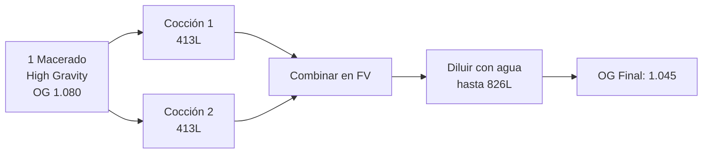
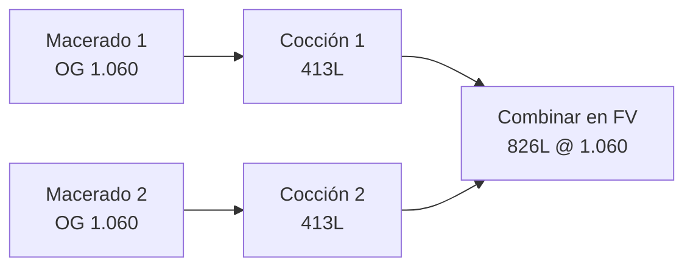

# Desert Brew OS - Técnicas de Macerado

> **Guía de procesos de cocción según densidad objetivo**

---

## 🧪 Técnicas de Macerado

### Técnica 1: High Gravity Brewing (Baja Densidad Final)

**Aplicación:** Lagers, Amber Lager  
**OG Target:** < 1.050

#### Proceso



**Ventajas:**
- ✅ Eficiencia de macerado (1 vez vs. 2)
- ✅ Ahorro de tiempo (~2 horas)
- ✅ Menor consumo de malta
- ✅ Control preciso de OG final mediante dilución

**Pasos:**
1. **Macerado único** @ OG 1.080 (concentrado)
2. **Cocción 1** → ~365 L @ 1.080
3. **Cocción 2** (mismo grano rinsing) → ~368 L @ 1.080
4. **Combinar** en fermentador → 733 L @ 1.080
5. **Diluir** con agua desoxigenada → 826 L @ **OG 1.045**

**Ejemplo: Velafrons Lager**
- Target: 4.5% ABV, OG 1.045
- Macerado HG: 1.080
- Dilución: 733 L → 826 L
- Factor dilución: 1.127×

---

### Técnica 2: Double Mash (Alta Densidad)

**Aplicación:** Imperial IPA, American Stout  
**OG Target:** > 1.055

#### Proceso



**Ventajas:**
- ✅ Grano fresco en cada macerado (enzimas activas)
- ✅ Mejor eficiencia de conversión
- ✅ Mayor consistencia de gravity
- ✅ No requiere dilución

**Pasos:**
1. **Macerado 1** con grano nuevo → Cocción 1 → ~365 L @ 1.060
2. **Macerado 2** con grano nuevo → Cocción 2 → ~368 L @ 1.060
3. **Combinar** en fermentador → 733 L @ **OG 1.060**
4. Sin dilución (volumen final ~750 L después de mermas)

**Ejemplo: Coahuilaceratops Imperial IPA**
- Target: 7.2% ABV, OG 1.072
- 2 macerados completos
- Volumen final: ~750 L

---

## 📋 Tabla de Decisión

| Estilo | OG Target | Técnica | Macerados | Dilución | Tiempo Total |
|--------|-----------|---------|-----------|----------|--------------|
| Velafrons Lager | 1.045 | High Gravity | 1 | Sí (+93 L) | ~8 horas |
| Carnotaurus Amber | 1.051 | High Gravity | 1 | Leve (+50 L) | ~8 horas |
| Coahuilaceratops IPA | 1.072 | Double Mash | 2 | No | ~10 horas |
| T-Rex Stout | 1.068 | Double Mash | 2 | No | ~10 horas |

---

## 🧮 Cálculos de Dilución (High Gravity)

### Fórmula

```
Volumen_Final = Volumen_Concentrado × (OG_Concentrado - 1) / (OG_Target - 1)
```

### Ejemplo Práctico

**Receta:** Velafrons Lager  
**Target:** 826 L @ OG 1.045  
**Concentrado:** 733 L @ OG 1.080

```python
# Cálculo
V_final = 733 × (1.080 - 1.000) / (1.045 - 1.000)
V_final = 733 × 0.080 / 0.045
V_final = 1,302 L

# Agua a agregar
Agua = 1,302 - 733 = 569 L

# NOTA: En práctica real, ajustar por mermas
# Si tenemos 733 L concentrados, necesitamos ~93 L de agua para 826 L @ 1.045
```

**Fórmula simplificada:**
```
Agua_Agregar = Volumen_Target - Volumen_Concentrado
```

---

## 🔧 Implementación en Sistema

### Modelo de Base de Datos

```python
class ProductionBatch(Base):
    # ... campos base ...
    
    # Técnica de cocción
    brewing_technique: str  # "HIGH_GRAVITY", "DOUBLE_MASH"
    
    # High Gravity específico
    concentrated_og: Decimal | None     # 1.080
    dilution_water_liters: Decimal | None   # 93 L
    
    # Double Mash específico
    mash1_date: datetime | None
    mash2_date: datetime | None
```

### Endpoint de Dilución

```python
POST /api/v1/batches/{id}/dilute

{
  "concentrated_volume": 733,
  "concentrated_og": 1.080,
  "water_added_liters": 93,
  "final_og_measured": 1.045
}

# Sistema valida que final_og esté dentro del margen (± 0.003)
```

---

**Última actualización:** 2026-02-02  
**Autor:** Equipo de Producción Desert Brew Co.
