# Desert Brew OS - Pipelines Principales

> **Flujos de datos end-to-end del sistema**

---

## 🏭 Pipeline 1: Producción de Cerveza (Batch Completo)

### Flow: Receta → Producción → Empaque → Inventario → Venta

```mermaid
graph LR
    A[Crear Receta] --> B[Planificar Batch]
    B --> C[Allocate Stock FIFO]
    C --> D[Brew Day]
    D --> E[Fermentación 14d]
    E --> F[Packaging]
    F --> G[Cold Room Inventory]
    G --> H[Venta/Distribución]
```



### Pasos Detallados

**1. Crear Receta (Production Service)**
```http
POST /api/v1/production/recipes
{
  "name": "IPA Coahuilaceratops v3.2",
  "target_volume_liters": 40,
  "target_og_brix": 17.5,
  "ingredients": [
    {"sku": "MALTA-PALE-2ROW", "quantity_kg": 9.5},
    {"sku": "HOPULO-CASCADE", "quantity_g": 150}
  ]
}
```

**2. Crear Batch de Producción**
```http
POST /api/v1/production/batches
{
  "recipe_id": 15,
  "brew_date": "2026-02-10",
  "brewer_id": 5
}
```

**3. Event: `batch.created` → Inventory allocate_stock_fifo**
```python
# Inventory Service listener
@event_handler("batch.created")
def allocate_ingredients(event_data):
    for ingredient in event_data.ingredients:
        allocate_stock_fifo(
            sku=ingredient.sku,
            quantity=ingredient.quantity,
            batch_id=event_data.batch_id
        )
```

**4. Brew Day - Registrar Mediciones**
```http
PATCH /api/v1/production/batches/{id}/brewing-complete
{
  "measured_og_brix": 17.3,
  "measured_mash_ph": 5.4,
  "volume_to_fermenter": 38.5
}
```

**5. Fermentación - Tracking Diario**
```http
POST /api/v1/production/batches/{id}/readings
{
  "days_since_pitch": 7,
  "brix": 5.2,
  "temperature_celsius": 19.1
}
```

**6. Packaging - Embarrilar**
```http
POST /api/v1/production/batches/{id}/package
{
  "keg_ids": ["KEG-050", "KEG-051"],
  "measured_fg_brix": 3.4,
  "packaging_date": "2026-02-24"
}
```

**7. Event: `batch.packaged` → Cold Room Inventory**
```python
# Inventory Service listener
@event_handler("batch.packaged")
def create_finished_product(event_data):
    FinishedProductInventory.create(
        sku="BEER-IPA-COAHUI-KEG30L",
        production_batch_id=event_data.batch_id,
        quantity=2,
        location="Cold Room A"
    )
```

**8. Venta en Taproom**
```http
POST /api/v1/pos/orders
{
  "items": [{"sku": "BEER-IPA-COAHUI-DRAFT", "quantity": 1}]
}
# Deduce de cold room inventory
```

---

## 💧 Pipeline 2: Producción de Agua Mineral

### Flow: Formulación → Embotellado → Inventario → Venta

```mermaid
graph LR
    A[Purificación] --> B[Carbonatación]
    B --> C[Saborizante]
    C --> D[Embotellado]
    D --> E[Etiquetado]
    E --> F[Cold Room]
    F --> G[Venta]
```



### Pasos

**1. Crear Water Batch**
```http
POST /api/v1/production/water-batches
{
  "water_type": "SPARKLING",
  "flavor": "Limón",
  "target_volume_liters": 500,
  "co2_kg": 2.5
}
```

**2. Consumir CO2 de Inventory**
```http
POST /api/v1/inventory/gas-consumption
{
  "gas_tank_id": "CO2-001",
  "quantity_kg": 2.5,
  "batch_id": "WATER-2026-042"
}
```

**3. Embotellar**
```http
PATCH /api/v1/production/water-batches/{id}/package
{
  "container_type": "PET_BOTTLE",
  "units_produced": 1000
}
```

**4. Cold Room Inventory**
```http
POST /api/v1/inventory/finished-products
{
  "sku": "WATER-SPARK-LIMON-500ML",
  "quantity": 1000,
  "unit_cost": 3.25,
  "location": "Cold Room B"
}
```

---

## 🚚 Pipeline 3: Venta B2B (Restaurante)

### Flow: Pedido → Credit Check → Fulfillment → Entrega → Factura


### Pasos

**1. Cliente Crea Pedido**
```http
POST /api/v1/sales/orders
{
  "client_id": 25,
  "sales_channel": "B2B_RESTAURANT",
  "items": [
    {"sku": "BEER-IPA-COAHUI-KEG30L", "quantity": 5}
  ],
  "delivery_date": "2026-02-15"
}
```

**2. Double-Gate Credit Check**
```python
# Sales Service
async def validate_order(order, client):
    # Check 1: Saldo
    balance = await finance_service.get_balance(client.id)
    if balance + order.total > client.credit_limit:
        raise CreditBlockedException("Límite de crédito excedido")
    
    # Check 2: Kegs prestados
    kegs_out = await inventory_service.count_kegs(
        client_id=client.id,
        state="IN_CLIENT"
    )
    if kegs_out >= client.max_allowed_kegs:
        raise CreditBlockedException("Límite de barriles excedido")
```

**3. Reservar Inventory**
```http
POST /api/v1/inventory/finished-products/reserve
{
  "order_id": "ORD-2026-123",
  "items": [
    {"sku": "BEER-IPA-COAHUI-KEG30L", "quantity": 5}
  ]
}
```

**4. Preparar Kegs**
```http
POST /api/v1/inventory/kegs/bulk-transition
{
  "keg_ids": ["KEG-050", "KEG-051", "KEG-052", "KEG-053", "KEG-054"],
  "new_state": "IN_TRANSIT",
  "order_id": "ORD-2026-123"
}
```

**5. Entrega**
```http
PATCH /api/v1/sales/orders/{id}/deliver
{
  "delivered_at": "2026-02-15T10:30:00",
  "driver_id": 10,
  "signature": "base64..."
}

# Update kegs
PATCH /api/v1/inventory/kegs/bulk-transition
{
  "keg_ids": [...],
  "new_state": "IN_CLIENT",
  "client_id": 25,
  "location": "Restaurante El Túnel"
}
```

**6. Facturación**
```http
POST /api/v1/finance/invoices
{
  "order_id": "ORD-2026-123",
  "client_id": 25,
  "subtotal": 14000.00,
  "ieps": 3710.00,
  "iva": 2833.60,
  "total": 20543.60,
  "payment_terms": "NET_30"
}
```

---

## 🛒 Pipeline 4: Venta en Taproom (POS)

### Flow: Orden → Cocina → Servicio → Pago → Propinas


### Pasos

**1. Mesero Crea Orden**
```http
POST /api/v1/pos/orders
{
  "table_number": 8,
  "server_id": 12,
  "items": [
    {"sku": "BEER-IPA-COAHUI-DRAFT", "quantity": 2},
    {"sku": "FOOD-BURGER-CHEESE", "quantity": 1}
  ]
}
```

**2. Auto-Split Kitchen vs. Bar**
```python
# POS Service
def route_order_items(items):
    for item in items:
        if item.category in ["BEER", "WATER"]:
            send_to_bar(item)
        elif item.category == "FOOD":
            send_to_kds(item)
```

**3. KDS (Kitchen Display)**
```http
WebSocket: /ws/kds
{
  "order_id": "POS-2026-523",
  "table": 8,
  "items": [
    {"name": "Burger con Queso", "mods": ["Sin cebolla"]}
  ],
  "priority": "NORMAL"
}
```

**4. Marcar Items Listos**
```http
PATCH /api/v1/pos/orders/{id}/items/{item_id}/ready
{
  "prepared_by": 3  # Chef
}
```

**5. Cerrar Cuenta**
```http
PATCH /api/v1/pos/orders/{id}/close
{
  "payment_method": "CARD",
  "subtotal": 205.00,
  "tip_percentage": 15,
  "tip_amount": 30.75,
  "closed_by": 8  # Bartender
}
```

**6. Registrar Propinas**
```http
POST /api/v1/staff/tips
{
  "order_id": "POS-2026-523",
  "server_id": 12,
  "amount": 30.75,
  "distribution": {
    "server": 30.75,    # 100%
    "runner": 0         # No aplica
  }
}
```

---

## 📦 Pipeline 5: Recepción de Materia Prima

### Flow: Compra → Recepción → QA → Inventory → Pago

```mermaid
graph LR
    A[Purchase Order] --> B[Recepción Física]
    B --> C[QA Check]
    C --> D{Pass?}
    D -->|Sí| E[Create StockBatch]
    D -->|No| F[Rechazo]
    E --> G[Update Supplier]
    G --> H[CxP]
```



### Pasos

**1. Recepción Física**
```http
POST /api/v1/inventory/stock
{
  "sku": "MALTA-PALE-2ROW",
  "quantity_kg": 25,
  "supplier_id": 3,
  "purchase_order": "PO-2026-015",
  "invoice_number": "FAC-456",
  "unit_cost": 18.50,
  "received_by": 5
}
```

**2. QA Pass → Stock Available**
```python
# Auto después de crear
stock_batch.is_available = True
stock_batch.qa_passed_at = datetime.now()
```

**3. Event: `stock.received` → Finance CxP**
```python
@event_handler("stock.received")
def create_payable(event_data):
    AccountsPayable.create(
        supplier_id=event_data.supplier_id,
        invoice_number=event_data.invoice_number,
        amount=event_data.total_cost,
        due_date=today() + timedelta(days=30)
    )
```

---

## 🔄 Pipeline 6: Event-Driven Architecture

### Core Events

| Event | Publisher | Consumer | Action |
|-------|-----------|----------|--------|
| `batch.created` | Production | Inventory | Allocate stock FIFO |
| `batch.packaged` | Production | Inventory | Create finished product |
| `stock.low` | Inventory | Production | Alert low stock |
| `stock.received` | Inventory | Finance | Create payable |
| `order.confirmed` | Sales | Inventory | Reserve stock |
| `order.delivered` | Sales | Finance | Create invoice |
| `keg.filled` | Inventory | Sales | Update availability |

### RabbitMQ Topology

```
Exchanges:
  - production.events (topic)
  - inventory.events (topic)
  - sales.events (topic)
  - finance.events (topic)

Queues:
  - inventory.batch_created
  - inventory.stock_low
  - finance.create_payable
  - finance.create_invoice
```

---

## 🎯 Pipelines por Implementar

### Sprint 4-5: Production Service
- ✅ Recipe → Batch pipeline
- ✅ Fermentation tracking pipeline
- ✅ Packaging pipeline

### Sprint 7-8: Sales Service
- ✅ B2B order pipeline
- ✅ Credit check pipeline

### Sprint 10-12: POS
- ✅ Taproom order pipeline
- ✅ KDS pipeline
- ✅ Tips distribution pipeline

### Infraestructura
- [ ] RabbitMQ event bus
- [ ] Webhook callbacks
- [ ] Retry mechanisms
- [ ] Dead letter queues
