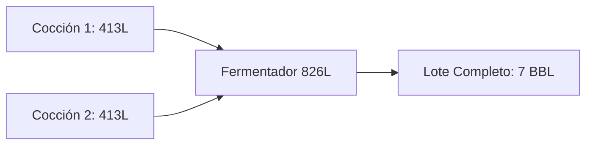

# Desert Brew OS - Configuración de Planta

> **Especificaciones técnicas de la cervecería Desert Brew Co., Saltillo**

---

## 🏭 Brewhouse (Sistema de Cocción)

### Capacidad y Configuración

**Sistema:** 3.5 BBL (Barrels) - Sistema de dobles cocciones

**Conversión:**
- 1 BBL = 118 L (aprox. estándar: 117.348 L)
- **Capacidad por cocción:** 3.5 BBL = **413 L**

### Equipos de Cocción

```python
class BrewhouseEquipment:
    MASHTUN = {
        "id": "MASHTUN-01",
        "capacity_liters": 450,  # Con headspace
        "working_capacity_liters": 413,
        "material": "Acero inoxidable 304",
        "temp_range": "35-78°C"
    }
    
    BOIL_KETTLE = {
        "id": "KETTLE-01",
        "capacity_liters": 450,
        "working_capacity_liters": 413,
        "boil_off_rate": 12,  # % por hora
        "heat_source": "Gas LP"
    }
    
    HOT_LIQUOR_TANK = {
        "id": "HLT-01",
        "capacity_liters": 600,
        "target_temp": 80,  # °C
        "heat_source": "Gas LP"
    }
```

### Flujo de Proceso (Doble Cocción)



**Tiempo estimado por doble cocción:**
- Cocción 1: ~5 horas (macerado + hervor + enfriado)
- Cocción 2: ~5 horas
- **Total:** ~10 horas para llenar 1 fermentador

---

## 🧪 Fermentadores

### Configuración de Tanques

| Tank ID | Capacidad | Material | Tipo | Enfriamiento |
|---------|-----------|----------|------|--------------|
| FV-01 | 7 BBL (826 L) | SS 304 | Cónico | Glicol |
| FV-02 | 7 BBL (826 L) | SS 304 | Cónico | Glicol |
| FV-03 | 7 BBL (826 L) | SS 304 | Cónico | Glicol |
| FV-04 | 7 BBL (826 L) | SS 304 | Cónico | Glicol |
| FV-05 | 7 BBL (826 L) | SS 304 | Cónico | Glicol |
| FV-06 | 7 BBL (826 L) | SS 304 | Cónico | Glicol |

**Capacidad total de fermentación:** 42 BBL = **4,956 L**

### Modelo de Base de Datos

```python
class FermentationTank(Base):
    id: str                     # "FV-01"
    capacity_bbl: Decimal       # 7
    capacity_liters: Decimal    # 826
    current_batch_id: str | None
    status: str                 # "AVAILABLE", "FERMENTING", "CONDITIONING", "CLEANING"
    last_cip_date: datetime | None
    glycol_zone: str            # "ZONE-A", "ZONE-B"
```

---

## � Sistema de Purificación de Agua

### Configuración del Sistema

**Importancia:** El agua representa el 90-95% de la cerveza. La calidad del agua es crítica para consistencia de sabor y eficiencia de procesos.

**Sistema instalado:** 3 Etapas de Filtración + Ósmosis Inversa (RO)

```python
class WaterTreatmentSystem:
    STAGE_1 = {
        "type": "Sediment Filter",
        "micron_rating": 5,
        "function": "Remoción de partículas sólidas",
        "replacement_frequency_months": 3
    }
    
    STAGE_2 = {
        "type": "Carbon Block Filter",
        "micron_rating": 1,
        "function": "Remoción de cloro, sabores, olores",
        "replacement_frequency_months": 6
    }
    
    STAGE_3 = {
        "type": "Carbon Granular Activated",
        "function": "Pulido final pre-RO",
        "replacement_frequency_months": 6
    }
    
    STAGE_4 = {
        "type": "Reverse Osmosis Membrane",
        "rejection_rate": 95,  # % TDS removal
        "capacity_gpd": 300,   # Gallons per day
        "replacement_frequency_months": 24
    }
```

### Parámetros de Agua Objetivo

| Parámetro | Agua SIMAS | Post-RO | Objetivo Cerveza |
|-----------|------------|---------|------------------|
| **TDS (ppm)** | 250-350 | < 50 | 50-150 (remineralización) |
| **pH** | 7.2-7.8 | 6.5-7.0 | 5.2-5.6 (macerado) |
| **Dureza (ppm CaCO₃)** | 180-220 | < 10 | Variable por estilo |
| **Cloro (ppm)** | 0.5-1.5 | 0 | 0 |

### Remineralización por Estilo

```python
class WaterProfile:
    """Perfiles de agua post-RO según estilo de cerveza."""
    
    IPA_PROFILE = {
        "calcium_ppm": 100,
        "sulfate_ppm": 250,  # Resalta amargor
        "chloride_ppm": 50,
        "bicarbonate_ppm": 0
    }
    
    LAGER_PROFILE = {
        "calcium_ppm": 50,
        "sulfate_ppm": 50,
        "chloride_ppm": 75,  # Suavidad
        "bicarbonate_ppm": 0
    }
    
    STOUT_PROFILE = {
        "calcium_ppm": 100,
        "sulfate_ppm": 50,
        "chloride_ppm": 100,
        "bicarbonate_ppm": 100  # Soporte de malta oscura
    }
```

### Programa de Mantenimiento

| Componente | Frecuencia | Costo MXN | Proveedor |
|------------|------------|-----------|-----------|
| **Filtro Sedimento 5µ** | 3 meses | $350 | Hidro Pure |
| **Filtro Carbon Block** | 6 meses | $650 | Hidro Pure |
| **Filtro GAC** | 6 meses | $550 | Hidro Pure |
| **Membrana RO** | 24 meses | $4,500 | Hidro Pure |
| **Análisis de agua** | 6 meses | $1,200 | Lab externo |
| **Sanitización sistema** | 12 meses | $800 | Interno |

**Costo anual estimado:** $6,000 MXN

### Monitoreo en Sistema

```python
class WaterQualityLog(Base):
    id: int
    measurement_date: datetime
    tds_input: Decimal      # ppm antes de RO
    tds_output: Decimal     # ppm después de RO
    ph: Decimal
    temperature: Decimal
    flow_rate_lpm: Decimal  # Litros por minuto
    
    # Alertas
    membrane_efficiency: Decimal  # % calculado
    requires_maintenance: bool
```

**Trigger de alerta:**
```python
if tds_output > 50 or membrane_efficiency < 90:
    send_alert("Revisar pre-filtros o membrana RO")
```

---

## �💰 Gastos Fijos Mensuales

### Categorías de Costos Operativos

```python
class FixedExpense(Base):
    id: int
    category: str
    subcategory: str | None
    amount_mxn: Decimal
    billing_cycle: str          # "MONTHLY", "BIMONTHLY"
    provider: str | None
    due_day: int                # Día de vencimiento
    is_active: bool
```

### Estructura de Gastos

#### 1. Servicios Básicos

| Categoría | Proveedor | Monto Aprox. | Ciclo |
|-----------|-----------|--------------|-------|
| **Internet** | Totalplay/Telmex | $800 MXN | Mensual |
| **Agua** | SIMAS Saltillo | $2,500 MXN | Bimestral |
| **Luz** | CFE | $15,000 MXN | Mensual |
| **Gas LP** | Grupo Tomza | $8,000 MXN | Variable (por tanque) |

#### 2. Personal

```python
# Nómina base
SALARY_CATEGORIES = {
    "brewmaster": 25000,
    "assistant_brewer": 15000,
    "packaging_operator": 12000,
    "delivery_driver": 10000,
    "taproom_manager": 18000,
    "waiter": 8000 + propinas,
    "bartender": 9000 + propinas
}
```

**Total aprox. nómina mensual:** $120,000 - $150,000 MXN

#### 3. Mantenimiento

| Tipo | Descripción | Frecuencia | Costo |
|------|-------------|------------|-------|
| **MTTP** | Mantenimiento Preventivo | Mensual | $5,000 MXN |
| - Chiller de glicol | Revisión filtros | Mensual | $800 |
| - Bombas | Lubricación | Trimestral | $1,200 |
| - Instrumentación | Calibración sensores | Semestral | $3,500 |

#### 4. Cuentas por Pagar

```python
class AccountsPayable(Base):
    id: int
    supplier_id: str
    invoice_number: str
    concept: str                # "Malta Pale 2-Row - 500kg"
    amount_mxn: Decimal
    due_date: datetime
    payment_status: str         # "PENDING", "PARTIAL", "PAID"
    days_overdue: int           # Calculado automáticamente
```

---

## 📊 Cálculo de Costos por Lote

### Fórmula de Costo Total

```python
def calculate_batch_total_cost(batch_id: str) -> Decimal:
    """
    Costo total del lote considerando doble cocción.
    """
    # 1. Ingredientes (FIFO allocation)
    ingredients_cost = get_ingredient_cost(batch_id)
    
    # 2. Mano de obra
    # Doble cocción = 10 horas * tasa horaria brewmaster
    labor_hours = 10
    labor_rate = Decimal('125')  # $25,000/mes ÷ 200h/mes
    labor_cost = labor_hours * labor_rate
    
    # 3. Gas LP
    # Estimado: 40kg LP por doble cocción
    gas_kg = 40
    gas_rate = Decimal('24')  # $/kg
    gas_cost = gas_kg * gas_rate
    
    # 4. Electricidad
    # Estimado: 50 kWh por doble cocción (bombas, chiller)
    kwh_used = 50
    kwh_rate = Decimal('3.5')  # Tarifa industrial CFE
    electricity_cost = kwh_used * kwh_rate
    
    # 5. Agua
    # Estimado: 2,000 L por doble cocción (limpieza + proceso)
    water_liters = 2000
    water_rate = Decimal('0.015')  # $/L
    water_cost = water_liters * water_rate
    
    total_direct_cost = (
        ingredients_cost +
        labor_cost +
        gas_cost +
        electricity_cost +
        water_cost
    )
    
    # 6. Overhead (gastos fijos prorrateados)
    # Asumiendo 8 lotes/mes
    monthly_fixed = Decimal('50000')  # Internet + MTTP + otros
    overhead_per_batch = monthly_fixed / 8
    
    total_cost = total_direct_cost + overhead_per_batch
    
    # Costo por litro
    volume_packaged = get_packaged_volume(batch_id)  # ~750 L después de mermas
    cost_per_liter = total_cost / volume_packaged
    
    return {
        "total_cost": total_cost,
        "cost_per_liter": cost_per_liter,
        "breakdown": {
            "ingredients": ingredients_cost,
            "labor": labor_cost,
            "gas": gas_cost,
            "electricity": electricity_cost,
            "water": water_cost,
            "overhead": overhead_per_batch
        }
    }
```

---

## 📈 Capacidad de Producción

### Cálculo Mensual

**Asumiendo operación 5 días/semana:**

- **Lotes por semana:** 2-3 (limitado por doble cocción de 10h)
- **Lotes por mes:** ~10 lotes
- **Producción mensual:** 10 lotes × 750 L empacados = **7,500 L**
- **Producción anual:** 7,500 L × 12 = **90,000 L** (900 HL)

### Cuello de Botella

**Limitante actual:** Brewhouse de 3.5 BBL requiere dobles cocciones.

**Estrategia de crecimiento:**
1. **Corto plazo:** Optimizar turnos (cocciones nocturnas)
2. **Mediano plazo:** Upgrade a Brewhouse 7 BBL (elimina dobles cocciones)
3. **Largo plazo:** Segundo brewhouse o sistema automatizado

---

## 🔧 Integración con Desert Brew OS

### Configuración en Sistema

```python
# services/production_service/config/plant_config.py

BREWHOUSE_CONFIG = {
    "capacity_bbl": 3.5,
    "capacity_liters": 413,
    "requires_double_brew": True,
    "avg_brew_time_hours": 5,
    "boil_off_rate_percent": 12
}

FERMENTATION_TANKS = [
    {"id": "FV-01", "capacity_liters": 826, "glycol_zone": "A"},
    {"id": "FV-02", "capacity_liters": 826, "glycol_zone": "A"},
    {"id": "FV-03", "capacity_liters": 826, "glycol_zone": "A"},
    {"id": "FV-04", "capacity_liters": 826, "glycol_zone": "B"},
    {"id": "FV-05", "capacity_liters": 826, "glycol_zone": "B"},
    {"id": "FV-06", "capacity_liters": 826, "glycol_zone": "B"},
]

FIXED_EXPENSES_MONTHLY = {
    "internet": 800,
    "electricity": 15000,
    "gas_lp": 8000,
    "maintenance": 5000,
    # Agua se factura bimestral
}
```

### Endpoint de Capacidad Disponible

```python
@router.get("/capacity/available")
def get_available_capacity(db: Session):
    """
    Calcula cuántos lotes más se pueden fermentar.
    """
    tanks_available = db.query(FermentationTank)\
        .filter(FermentationTank.status == "AVAILABLE")\
        .count()
    
    return {
        "tanks_available": tanks_available,
        "max_batches_possible": tanks_available,
        "total_capacity_liters": tanks_available * 826
    }
```

---

**Última Actualización:** 2026-02-02  
**Responsable:** Equipo de Operaciones
