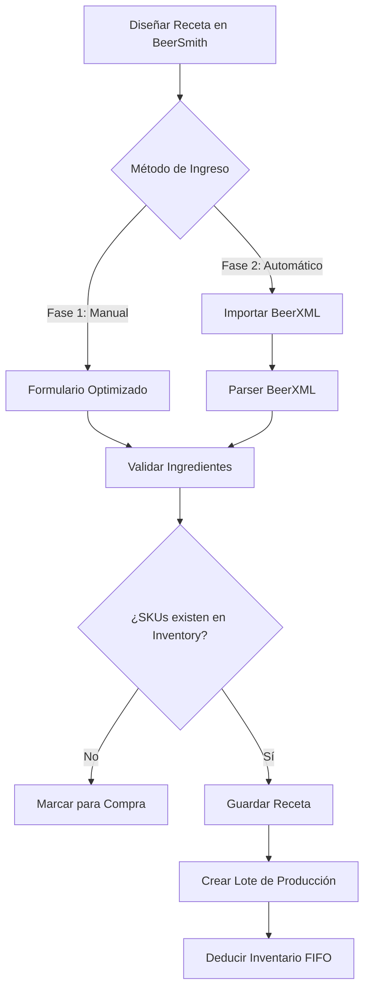
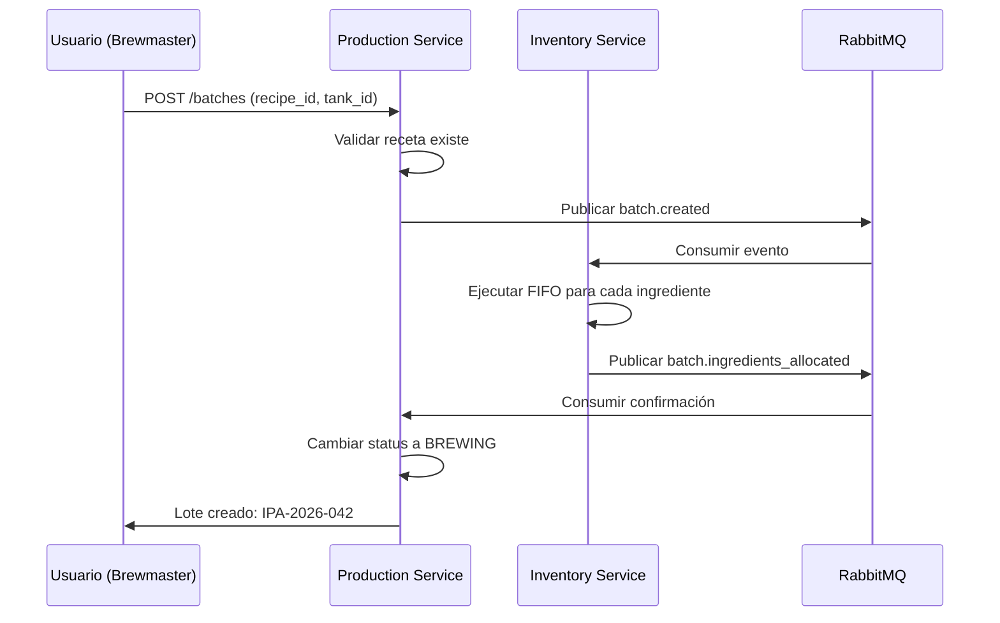

# Production Service - README

> **Servicio de Producción: Recetas, Lotes, Trazabilidad y Telemetría IoT**

---

## 🎯 Objetivo

El **Production Service** gestiona todo el proceso de elaboración de cerveza:

1. **Recetas** con integración BeerSmith
2. **Lotes de Producción** (Batches) con trazabilidad completa
3. **Telemetría IoT** para monitoreo de fermentación
4. **Análisis Predictivo** de salud de fermentación

---

## 🏗️ Arquitectura del Servicio

### Stack Tecnológico

- **Framework:** FastAPI 0.110+
- **Base de Datos:** TimescaleDB (extensión PostgreSQL)
- **ORM:** SQLAlchemy 2.0 (async)
- **Message Queue:** RabbitMQ (eventos de producción)
- **IoT:** MQTT + Telegraf bridge

### Estructura de Directorios

```
production_service/
├── models/
│   ├── recipe.py           # Recipe, RecipeIngredient
│   ├── batch.py            # ProductionBatch, BatchPhase
│   ├── fermentation.py     # FermentationReading (Hypertable)
│   └── beersmith.py        # BeerXML parser
├── api/
│   ├── recipe_routes.py    # CRUD de recetas
│   ├── batch_routes.py     # Gestión de lotes
│   └── telemetry_routes.py # Ingesta IoT
├── analytics/
│   └── fermentation.py     # Análisis de salud
├── parsers/
│   └── beerxml.py          # Importador BeerSmith
├── schemas/
│   └── ...                 # Pydantic schemas
├── tests/
│   ├── unit/
│   └── integration/
├── database.py
├── main.py
└── README.md (este archivo)
```

---

## 📦 Entidades Principales

### 1. Recipe (Receta)

**Concepto:** Fórmula maestra para elaborar un estilo de cerveza.

```python
class Recipe(Base):
    id: str                         # "IPA-DESERT-SUNSET-v3.2"
    name: str
    beer_style: str                 # "American IPA"
    version: int
    
    # Volúmenes (de BeerSmith)
    preboil_volume_liters: Decimal
    postboil_volume_liters: Decimal
    target_volume_liters: Decimal   # Al fermentador
    
    # Eficiencia
    brewhouse_efficiency: Decimal   # ej: 72%
    
    # Gravities
    target_og: Decimal              # 1.060
    target_fg: Decimal              # 1.012
    target_abv: Decimal             # Calculado: 6.3%
    
    # IBUs y Color
    ibu: Decimal | None
    srm: Decimal | None             # Color (Standard Reference Method)
    
    # Metadata
    created_by: str
    created_at: datetime
    is_active: bool                 # True para receta actual
    
    # Relaciones
    ingredients: List[RecipeIngredient]
```

### 2. RecipeIngredient

```python
class RecipeIngredient(Base):
    id: int
    recipe_id: str
    
    ingredient_type: str            # "MALT", "HOPS", "YEAST", "ADJUNCT"
    sku: str                        # Link a Inventory Service
    quantity: Decimal
    unit: str                       # "KG", "G", "L", "ML"
    
    # Específico para lúpulo
    boil_time_minutes: int | None   # 60, 30, 0 (dry hop)
    alpha_acid: Decimal | None      # % AA
    
    # Específico para malta
    lovibond: Decimal | None        # Color
    
    # Orden en la receta
    addition_order: int
```

### 3. ProductionBatch (Lote)

```python
class ProductionBatch(Base):
    id: str                         # "IPA-2026-042"
    recipe_id: str
    
    status: str                     # "BREWING", "FERMENTING", "CONDITIONING", "PACKAGED"
    
    # Fechas de fases
    brew_date: datetime
    fermentation_start: datetime | None
    packaging_date: datetime | None
    
    # Volúmenes reales
    actual_preboil_volume: Decimal
    actual_postboil_volume: Decimal
    volume_to_fermenter: Decimal
    volume_packaged: Decimal        # Para cálculo de mermas
    
    # Gravities reales
    measured_og: Decimal
    measured_fg: Decimal | None
    final_abv: Decimal | None
    
    # Asignación
    tank_id: str                    # "FV-01"
    brewer_id: str
    
    # Notas
    brewers_notes: str | None
```

---

## 🍺 Integración con BeerSmith

### Flujo de Trabajo Híbrido



### Opción 1: Formulario Manual (Sprint 4)

**Endpoint:**
```python
POST /api/v1/recipes
Content-Type: application/json

{
  "name": "IPA Desert Sunset",
  "beer_style": "American IPA",
  "version": 3,
  "preboil_volume_liters": 25.0,
  "postboil_volume_liters": 22.0,
  "target_volume_liters": 20.0,
  "brewhouse_efficiency": 72.0,
  "target_og": 1.060,
  "target_fg": 1.012,
  "ibu": 65,
  "ingredients": [
    {
      "ingredient_type": "MALT",
      "sku": "MALT-PALE-2ROW",
      "quantity": 5.5,
      "unit": "KG"
    },
    {
      "ingredient_type": "HOPS",
      "sku": "HOPS-CASCADE",
      "quantity": 100,
      "unit": "G",
      "boil_time_minutes": 60,
      "alpha_acid": 7.5
    }
  ]
}
```

**UI Optimizada:**

Flutter form con secciones colapsables:
- **Información General** (nombre, estilo, versión)
- **Volúmenes** (3 inputs: pre-boil, post-boil, target)
- **Gravities** (OG, FG con cálculo automático de ABV)
- **Ingredientes** (tabla dinámica con +/- rows)

### Opción 2: Importador BeerXML (Sprint 6+)

**Endpoint:**
```python
POST /api/v1/recipes/import-beersmith
Content-Type: multipart/form-data

file: [archivo.bsmx o .xml]
```

**BeerXML Sample:**
```xml
<RECIPE>
  <NAME>IPA Desert Sunset</NAME>
  <TYPE>All Grain</TYPE>
  <BREWER>Desert Brew Co</BREWER>
  <BATCH_SIZE>20.0</BATCH_SIZE>
  <BOIL_SIZE>25.0</BOIL_SIZE>
  <EFFICIENCY>72.0</EFFICIENCY>
  <HOPS>
    <HOP>
      <NAME>Cascade</NAME>
      <AMOUNT>0.100</AMOUNT>
      <USE>Boil</USE>
      <TIME>60</TIME>
      <ALPHA>7.5</ALPHA>
    </HOP>
  </HOPS>
  <FERMENTABLES>
    <FERMENTABLE>
      <NAME>Pale Malt 2-Row</NAME>
      <AMOUNT>5.5</AMOUNT>
      <TYPE>Grain</TYPE>
    </FERMENTABLE>
  </FERMENTABLES>
</RECIPE>
```

**Parser Logic:**
```python
# parsers/beerxml.py

import xml.etree.ElementTree as ET
from typing import Dict

def parse_beerxml(file_content: bytes) -> Dict:
    """
    Parsea un archivo BeerXML y extrae datos para Recipe.
    
    Returns:
        Dict con estructura compatible con RecipeCreate schema
    """
    root = ET.fromstring(file_content)
    recipe = root.find('RECIPE')
    
    ingredients = []
    
    # Maltas
    for fermentable in recipe.findall('.//FERMENTABLE'):
        ingredients.append({
            "ingredient_type": "MALT",
            "sku": map_beersmith_to_sku(fermentable.find('NAME').text),
            "quantity": float(fermentable.find('AMOUNT').text),
            "unit": "KG"
        })
    
    # Lúpulos
    for hop in recipe.findall('.//HOP'):
        ingredients.append({
            "ingredient_type": "HOPS",
            "sku": map_beersmith_to_sku(hop.find('NAME').text),
            "quantity": float(hop.find('AMOUNT').text) * 1000,  # kg -> g
            "unit": "G",
            "boil_time_minutes": int(hop.find('TIME').text),
            "alpha_acid": float(hop.find('ALPHA').text)
        })
    
    return {
        "name": recipe.find('NAME').text,
        "beer_style": recipe.find('STYLE/NAME').text,
        "target_volume_liters": float(recipe.find('BATCH_SIZE').text),
        "preboil_volume_liters": float(recipe.find('BOIL_SIZE').text),
        "brewhouse_efficiency": float(recipe.find('EFFICIENCY').text),
        "ingredients": ingredients
    }

def map_beersmith_to_sku(beersmith_name: str) -> str:
    """
    Mapea nombres de BeerSmith a SKUs del sistema.
    
    Ejemplo:
        "Pale Malt 2-Row" -> "MALT-PALE-2ROW"
        "Cascade [7.5% AA]" -> "HOPS-CASCADE"
    """
    mapping = {
        "Pale Malt 2-Row": "MALT-PALE-2ROW",
        "Munich Malt": "MALT-MUNICH",
        "Cascade": "HOPS-CASCADE",
        "Centennial": "HOPS-CENTENNIAL",
        # ... más mappings
    }
    
    # Fuzzy matching
    for key, value in mapping.items():
        if key.lower() in beersmith_name.lower():
            return value
    
    # Si no encuentra match, retornar genérico para revisión manual
    return f"UNKNOWN-{beersmith_name.upper().replace(' ', '-')}"
```

---

## 📊 Telemetría y Análisis

### FermentationReading (Hypertable)

```sql
CREATE TABLE fermentation_readings (
    time TIMESTAMPTZ NOT NULL,
    batch_id TEXT NOT NULL,
    tank_id TEXT NOT NULL,
    
    temperature DOUBLE PRECISION,
    gravity DOUBLE PRECISION,
    ph DOUBLE PRECISION,
    pressure DOUBLE PRECISION,
    do_ppb DOUBLE PRECISION,  -- Dissolved Oxygen
    
    PRIMARY KEY (time, batch_id)
);

SELECT create_hypertable('fermentation_readings', 'time', chunk_time_interval => INTERVAL '7 days');
```

### Análisis de Salud de Fermentación

```python
# analytics/fermentation.py

def analyze_fermentation_health(batch_id: str, target_fg: Decimal) -> Dict:
    """
    Detecta fermentaciones estancadas usando derivada de gravedad.
    
    Lógica:
        Si Δgravedad < 0.002 en 24h Y gravedad_actual > target_fg
        → Fermentación ESTANCADA
    """
    readings = get_last_48h_readings(batch_id)
    
    if len(readings) < 2:
        return {"status": "GATHERING_DATA"}
    
    current = readings[-1]
    day_ago = get_reading_24h_before(readings, current.time)
    
    if not day_ago:
        return {"status": "INSUFFICIENT_DATA"}
    
    delta_gravity = day_ago.gravity - current.gravity
    
    # Regla crítica
    if delta_gravity < 0.002 and current.gravity > target_fg:
        return {
            "status": "STALLED",
            "alert_level": "CRITICAL",
            "message": "Actividad de levadura detenida. Verificar temperatura o pitch rate.",
            "suggested_actions": [
                "Elevar temperatura +2°C",
                "Rousing (agitar levadura sedimentada)",
                "Verificar viabilidad de levadura"
            ]
        }
    
    # Calcular atenuación actual
    og = get_batch_og(batch_id)
    adf = ((og - current.gravity) / (og - 1.0)) * 100
    
    return {
        "status": "HEALTHY",
        "current_attenuation": round(adf, 2),
        "estimated_completion": predict_completion_date(readings, target_fg)
    }
```

---

## 🔄 Flujos Críticos

### Flow 1: Crear Lote desde Receta



### Flow 2: Registro de Datos Post-Cocción

```python
# Después de cocinar, el brewmaster ingresa datos reales

PATCH /api/v1/batches/IPA-2026-042/brewing-complete
{
  "actual_preboil_volume": 24.5,
  "actual_postboil_volume": 21.8,
  "volume_to_fermenter": 20.0,
  "measured_og": 1.058,
  "status": "FERMENTING"
}

# Sistema calcula mermas automáticamente
merma_boil = (24.5 - 21.8) / 24.5 * 100  # 11%
merma_transfer = (21.8 - 20.0) / 21.8 * 100  # 8.3%

# Si mermas > threshold, generar alerta
if merma_boil > 15:
    send_alert("Merma de cocción anormal")
```

---

## 📊 Reportes Clave

### 1. Genealogía de Lote (Trazabilidad Upstream)

```python
GET /api/v1/batches/IPA-2026-042/ingredients

Response:
{
  "batch_id": "IPA-2026-042",
  "recipe": "IPA Desert Sunset v3.2",
  "ingredients_used": [
    {
      "type": "MALT",
      "sku": "MALT-PALE-2ROW",
      "provider_batch": "LOT-2025-12-450",
      "provider": "Malterías Tepeyac",
      "quantity_kg": 5.5,
      "cost_mxn": 101.75
    },
    {
      "type": "HOPS",
      "sku": "HOPS-CASCADE",
      "provider_batch": "2025-HARVEST-CA",
      "provider": "Yakima Chief Hops",
      "quantity_g": 100,
      "cost_mxn": 85.00
    }
  ],
  "total_ingredient_cost": 186.75
}
```

### 2. Eficiencia de Brewhouse

```python
GET /api/v1/reports/brewhouse-efficiency?period=2026-01

# Compara eficiencia target vs real
{
  "period": "2026-01",
  "batches": 12,
  "avg_efficiency_target": 72.0,
  "avg_efficiency_actual": 68.5,
  "variance": -3.5,
  "action_needed": "Revisar molienda de malta o temperatura de maceración"
}
```

---

## 🧪 Testing

### Unit Test: Parser BeerXML

```python
def test_beerxml_parser_hops():
    xml_content = """
    <RECIPE>
      <HOPS>
        <HOP>
          <NAME>Cascade</NAME>
          <AMOUNT>0.100</AMOUNT>
          <TIME>60</TIME>
          <ALPHA>7.5</ALPHA>
        </HOP>
      </HOPS>
    </RECIPE>
    """
    
    result = parse_beerxml(xml_content.encode())
    
    assert len(result["ingredients"]) == 1
    assert result["ingredients"][0]["sku"] == "HOPS-CASCADE"
    assert result["ingredients"][0]["quantity"] == 100  # g
    assert result["ingredients"][0"]["alpha_acid"] == 7.5
```

### Integration Test: Crear Lote

```python
async def test_create_batch_deducts_inventory(db, rabbitmq):
    # Setup: Crear receta y stock
    recipe = create_recipe(id="IPA-DS-v3")
    create_stock(sku="MALT-PALE-2ROW", quantity=100)
    
    # Ejecutar
    response = await client.post("/batches", json={
        "recipe_id": "IPA-DS-v3",
        "tank_id": "FV-01"
    })
    
    # Verificar deducción en Inventory
    await asyncio.sleep(2)  # Wait for event processing
    stock = get_stock("MALT-PALE-2ROW")
    assert stock.remaining_quantity == 94.5  # 100 - 5.5
```

---

## 📊 Métricas de Éxito

| KPI | Target | Medición |
|-----|--------|----------|
| **Precisión de OG** | ± 0.003 | Desviación OG target vs. medido |
| **Eficiencia Promedio** | > 70% | Brewhouse efficiency |
| **Trazabilidad** | 100% | Lotes con ingredientes rastreables |
| **Uptime Telemetría** | > 99% | Lecturas IoT recibidas |

---

## 🚀 Deployment

```bash
# Desarrollo
cd services/production_service
docker-compose -f ../../infra/docker-compose.yml up timescaledb rabbitmq -d
python -m uvicorn main:app --reload --port 8002

# Producción
kubectl apply -f k8s/production-deployment.yaml
```

---

## 📚 Referencias

- [BeerXML Standard 1.0](http://www.beerxml.com/beerxml.htm)
- [TimescaleDB Hypertables](https://docs.timescale.com/timescaledb/latest/)
- [BeerSmith Export Guide](https://beersmith.com/help/)

---

**Última Actualización:** 2026-02-02  
**Maintainer:** Equipo de Ingeniería Desert Brew OS
